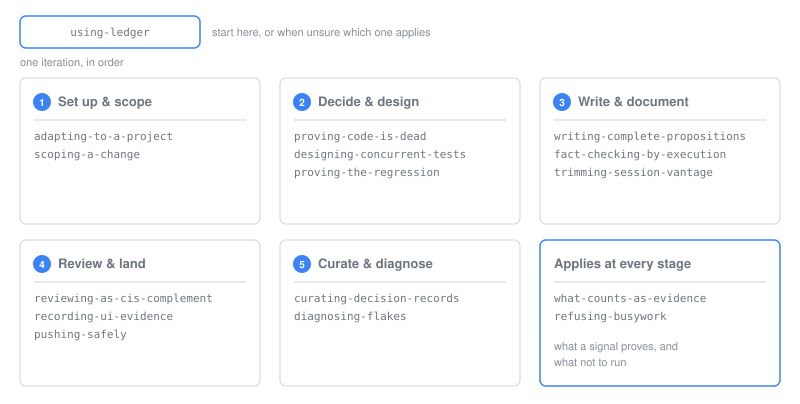

<div align="center">


**面向 agent 主笔代码库的工程账本 —— 每个主张都有条目，每个条目都可核查。**

[](https://github.com/qbs784/ledger/actions/workflows/gate.yml)
[](LICENSE)

[English](README.md) · **简体中文**

</div>

长程 agent 开发不是死于坏提交，而是死于静默腐化：散文不再描述代码、规则无人强制、死代码因无人能证明其已死而不敢删、主张堆积到无人能核查。每一种都在造成它的那次改动里看不见，在第一百次时变得昂贵。

`ledger` 是一个 Claude Code 插件，16 个 skill，用来阻止上面这四件事发生。

## 五支柱

**1. 文档是基底，不是副产品。** 对人类团队，文档是一种礼节；对一个跨越彼此无记忆的 session 工作的 agent，文档**就是**它的工作记忆。所以每个事实只有一个家 —— 常驻契约放在永远加载的指令文件里，理由放在带日期的决策记录里，流程放在工作流文档里，强制放在具名的检查里 —— 而且**一条规则一旦机械化，就晋升进那个检查，并从散文里删掉**。文档靠执行来核查：一条操作性主张唯一可采信的证据，是你真的跑过它。
→ `writing-complete-propositions`、`fact-checking-by-execution`

**2. Agent 原生构造。** 它是为「作者是模型」这个前提写的，不是从人类实践改写而来 —— 因为失效模式不同。模型的散文会系统性地带着作者会话的视角。模型积累投机性表面积又快又均匀。而且模型会声称成功。这三件各有一个 skill 对应；其中没有一件存在可迁移的人类实践等价物。
→ `trimming-session-vantage`、`what-counts-as-evidence`、`proving-code-is-dead`

**3. Loop 工程：让每次迭代又便宜又真。** 长程 loop 死于被浪费的轮次，而仪式像利息一样复利 —— 一次本不需要的全套测试，在第 400 轮和第 4 轮花的钱一样多，只是到那时它已经被付了 400 次。从**验证过**的基准算出改动集，而不是推断出来的。只跑那个真的会因为这次回归而失败的最窄检查。然后停手。
→ `scoping-a-change`、`refusing-busywork`

**4. 长程自动化需要可存续的记录。** 500 轮之后、或者半年之后的读者，必须还能解析每一个引用、重新推出每一个决策。这意味着决策记录按**剩余的未来价值**留存 —— 绝不按年龄、长度或清理配额 —— supersession 审计在写替代记录的**当时**就做，退役层靠内容哈希而不是靠约定变得不可变。
→ `curating-decision-records`、`recording-ui-evidence`

**5. 防腐化是建造要求，不是清理任务。** 钉住死值的**缺席**，让一个过期引用直接挂掉某个检查，而不是安静地变老。删掉代码之前先证明它已经死了。信任一个守卫之前先证明它会失败。
→ `proving-the-regression`、`designing-concurrent-tests`、`diagnosing-flakes`、`reviewing-as-cis-complement`、`pushing-safely`

## 七条规则

1. **最窄的充分证据。** 跑那个真的会失败的检查。绝不出于条件反射跑全套。
2. **绝不伪造绿灯。** 不许压制空结果、不许下调阈值、不许收窄范围来藏掉一个文件。
3. **归还预算，而不是发明余量。** 把一个本已获批的上限还回去不是掩盖；把一个从未被审视过的等待加宽才是。
4. **简短本身不是目标。** 光是字数变少，不构成改进。
5. **不要配额。** 年龄、长度、数量都是发现线索，绝不是判据。
6. **绿灯不是证据。** 覆盖率不等于正确性。一次通过的重跑什么都不证明。排进合并队列不等于已经落地。一个零命中的搜索在它匹配到一个已知正例之前什么都没证明。
7. **一个机制存在，不构成使用它的理由。** 工具会招来它有能力做的那些活。

大多数贡献指南在其中好几条上说的是反面：跑全部、留全部、缩短全部 —— 每一条都是一个条件反射，顶替了一次判断。

## Verify the world, not the self-report

> 一条断言必须**从外部**重跑那个命令、或重读那个文件，并确认它本不打算触碰的文件逐字节相同。

这么做不是因为更整洁，而是因为**对一个 worker 自己的输出做关键词探测，会让一个什么都没做的 worker 靠声称成功而通过**。当这个 worker 是一个无论如何都会产出自信摘要的模型时，摘要不是证据 —— 它是一个**关于**证据的主张，而两者会静默地分叉。

这是把 agent 主笔的代码库与人类代码库区分得最开的一条规则，而且它不止管测试：文档为什么要靠执行核查、守卫为什么需要负控、"通过了"为什么必须连同**实际跑了什么**一起报告，根源都在这里。

## 它不是什么

- 它**不**规定开发工作流。没有「先头脑风暴、再写规格、再实现」那套循环。
- 它**不**替你选架构、语言或工具链。
- 它**不**生成代码。

它管的是：代码库及其记录必须**能够证明**什么。这与你已经在用的任何工作流都可以叠加。

## 在生产中验证过

它是从 [DeepSeek Harness](https://github.com/deepseek-ai/deepseek-harness) —— 一个大型的、由 agent 主笔的代码库 —— 里抽取出来的，不是凭空设计的。抽取时实测的数字：

| | |
|---|---|
| 记录了一次 PR 合并的 merge commit | 1,302 |
| 活跃决策记录 | 658 已实现、27 提案中、9 已否决 |
| 已退役并内容封存的记录 | 175 |
| 治理性 skill 散文 | 2,412 行 / 26,739 词 |

这里每一条规则都能追溯到一个 commit、一份事故复盘、或一份决策记录 —— **包括那些反转**，而反转恰恰是让其余部分可信的那部分。两个例子：

- 一条关于运行时不变量伴生包的评审要求，作为权威**错了**四个星期。commit `15f2997b` 反转了它，在一次改动里从 **237 个包**移除了那个伴生包：1,407 个文件、11,398 行删除。取代它的规则 —— 一个检查必须比对**独立产生**的观测，否则就省略它并写明理由 —— 就是第 5 支柱。
- 那个语料里有两个文档 skill 语义腐坏、不得不退役。它们的死法一模一样：**它们写下了后来移动过的机器值**，而整个过程里每一个自动检查都是绿的。这就是为什么本包里没有任何一个 skill 写下命令。

## 安装

```sh
claude plugin marketplace add qbs784/ledger
claude plugin install ledger@ledger
```

或者直接从 clone 运行：

```sh
git clone https://github.com/qbs784/ledger
claude --plugin-dir ./ledger
```

这些 skill 都是朴素的目录式 bundle，frontmatter 只有 `name` 与 `description`，资源用相对路径引用，所以**文件本身**可以原样从项目的 `.claude/skills/`、`.agents/skills/`，或者 `~/.claude/skills/` 加载。但 skill 正文里用的 `ledger:<skill>` 路由写法只在插件安装下才解析 —— 详见 [docs/runtime-scope.md](docs/runtime-scope.md)。

## 适配层：没有 skill 写下命令

纪律是通用的，实现纪律的命令不是。一个把 `run-the-tests` 写死的 skill，在项目一变动的那一刻就过期了 —— 而且是静默过期，因为没有任何东西检查散文。所以每一个随项目而变的值都住在你仓库根目录的同一个文件 `.ledger.yml` 里，由 skill 去读：测试 lane、CI 已经拥有什么、哪些 hook 已经在跑、production 与非 production 的源码 glob，以及一份删除提案必须**驳倒**的**受保护接缝**清单。

从 `adapting-to-a-project` 开始。它写出那个文件 —— 并且在记录每条命令之前先真的跑一遍，因为**一个错的条目比一个缺失的条目更糟**：缺失会让 skill 停下来问你，而错误会让它跑起来并相信那个结果。

**大多数 skill 从不读它，也没有任何一个在等它。** 一个信号能证明什么、一段散文有没有自带它的命题、代码能不能被证明已死、CI 全绿之后一次评审还必须覆盖什么 —— 这些都不依赖于知道你的测试命令。只有那些必须真的**执行**某条命令的 skill 才会因为缺值而停下，而且它会停下来告诉你它缺的是哪一个值。缺少 `.ledger.yml` 只意味着一份便利还没有去取，它从来不是"这些纪律不适用于本仓库"的证据。这个区分是承重的，不是修饰性的：在一次真实测量里，一个已经读过路由的模型发现没有 `.ledger.yml`，就断定这个包在此仓库并未被采用，把整套纪律当作额外开销跳过了。

这个分离是被强制的，不只是意图。`tests/drift-gate.mjs` 会在以下情况失败：任何 skill 的散文里写了项目专属的指称；路由漏掉了一个已发布的 skill，或者路由指向一个不存在的 skill；某个随包发布的 reference 文件从未被它的 `SKILL.md` 用相对路径写出来（模型拿到的是一个基准目录，不是一份清单 —— 没被写出来的文件是不可达的）；或者某条 description 超过了目录会截断它的长度。跑 `node tests/drift-gate.mjs --self-test` 可以看它拒掉 21 个种植进去的缺陷 —— 一个没被人看着失败过的闸门，不算闸门。

## Skills



| Skill | 什么时候找它 |
|---|---|
| `using-ledger` | 刚开始，或者不确定该用哪一个 |
| `adapting-to-a-project` | 在一个新仓库里做初始设置 |
| `what-counts-as-evidence` | 正要声称某件事可用、通过了、或者做完了 |
| `refusing-busywork` | 在挑选检查，或者正要重跑一个已经通过的检查 |
| `scoping-a-change` | 要弄清一次改动到底触碰了什么 |
| `proving-the-regression` | 加了一个守卫；正要断言某个修复有效 |
| `designing-concurrent-tests` | 测试碰到端口、文件、环境变量、时钟或 teardown |
| `diagnosing-flakes` | 某个测试间歇性失败 |
| `writing-complete-propositions` | 在任何地方写或改任何散文 |
| `fact-checking-by-execution` | 要写下一个命令、默认值、错误信息或安装路径 |
| `trimming-session-vantage` | 散文读起来像泄漏出来的推理转录 |
| `proving-code-is-dead` | 要删代码，或者用依赖换掉手写实现 |
| `curating-decision-records` | 新增、审计或退役决策记录 |
| `reviewing-as-cis-complement` | 在评审一次改动，或者在回应评审 |
| `pushing-safely` | 推送、force-push，或者判断某个东西到底落地了没有 |
| `recording-ui-evidence` | 把一次 UI 演示录成视觉证据 |

### 常驻路由

`hooks/hooks.json` 会把路由注入每个 session，而且**默认开启**。这是一次刻意的反转，依据是一次测量而不是偏好。

在一个加载了 88 个工具、6 个插件的真实舞台上，15 个用例、每例 3 次，与一个剥掉注入的基线臂对照测得：

| | 产出了正确结果的运行 | 目标 skill 被加载的运行 |
|---|---|---|
| 带注入 | 38/48 —— 79% | 48/51 —— 94% |
| 只有 description | 31/48 —— 65% | 33/51 —— 65% |

两列要一起读，因为它们说的不是同一件事。**注入被测出会改变"哪个 skill 被加载"**——65% 到 94%，远超采样噪声。**它尚未被测出会改变"用户最终拿到什么"**：65% 到 79% 是一个方向正确的真实差异，但在每臂 48 次运行下达不到显著。任何人在决定是否保留这个 hook 时，应当把第一个数字当成已确立、把第二个当成有希望。

注入约 7 KB，也就是每次 session 启动约 1,800 token，明确且紧凑。如果你不想做这笔交易：删掉已安装副本里的 `hooks/`，或者把插件 manifest 的 `hooks` 路径指到一个不存在的位置。无论哪种，路由都仍然可以按名字调用。完整的两块板子、失败清单、以及四轮测量在 corpus 自身上查出的问题，都在 [evals/README.md](evals/README.md)。

这个 hook 出问题时退化成沉默，而不是搞坏一个 session：解释器缺失、路由文件缺失、或者任何读取失败，都以 0 退出且不输出任何东西。

**路由是唯一一个模型无法调用的 skill。** 它的 frontmatter 带着 `disable-model-invocation: true`，因为路由的 description 是给**挑选命令的人**看的摘要，不是给模型的触发词——而一个路由去和它本该分派的那 15 个 skill 争抢触发，本身就是自相矛盾的设计。它通过 hook 触达模型，通过名字触达人。

## 参与贡献

这里的规则大多靠强制而不是靠写下来：`npm test` 会把 drift gate 跑遍整个语料，`npm run test:self` 会种植缺陷并证明它逐个拒掉。两个都不花钱，两个都是 CI 在跑的。[CONTRIBUTING.md](CONTRIBUTING.md) 覆盖那几条检查说不出口的规则 —— 主要是：定位靠主张而不靠对比，以及一个新检查发布时必须附带一个证明它会失败的种植缺陷。

## 署名与许可

MIT。部分衍生自 [DeepSeek Harness](https://github.com/deepseek-ai/deepseek-harness) 的 agent 指令语料，后者同为 MIT 许可。上游版权声明保留在 [NOTICE](NOTICE)，本项目自身的条款在 [LICENSE](LICENSE)。
